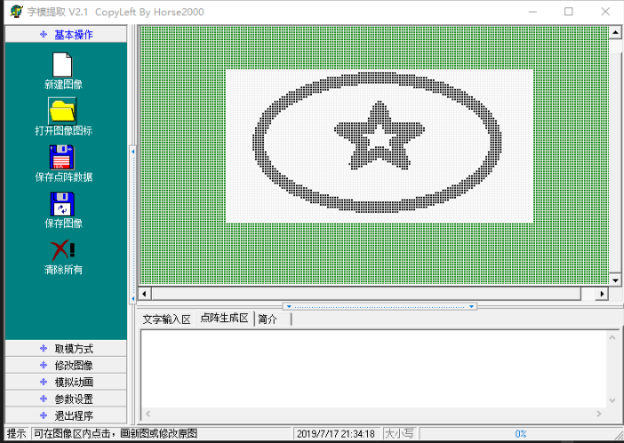
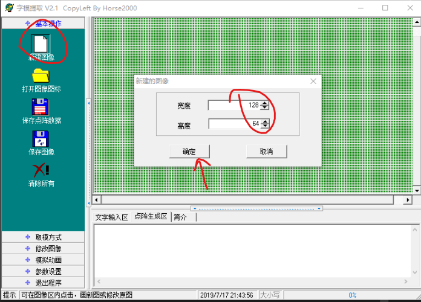
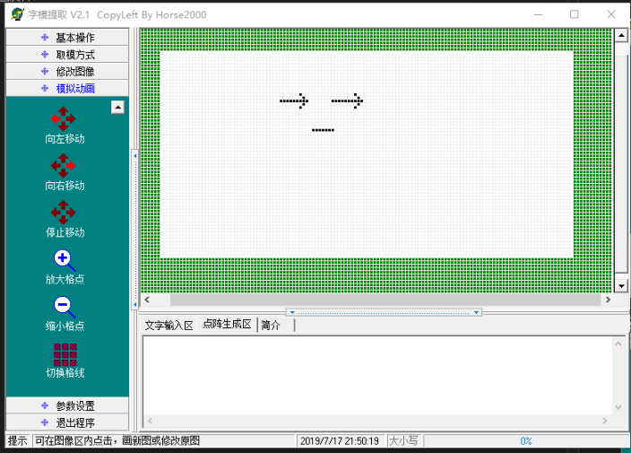
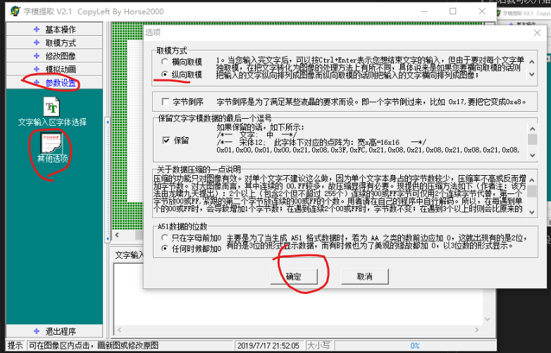
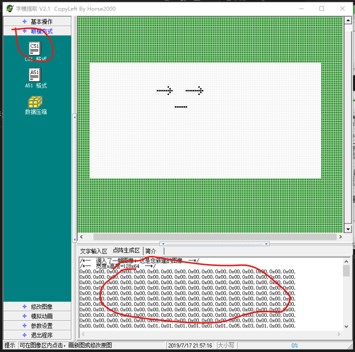
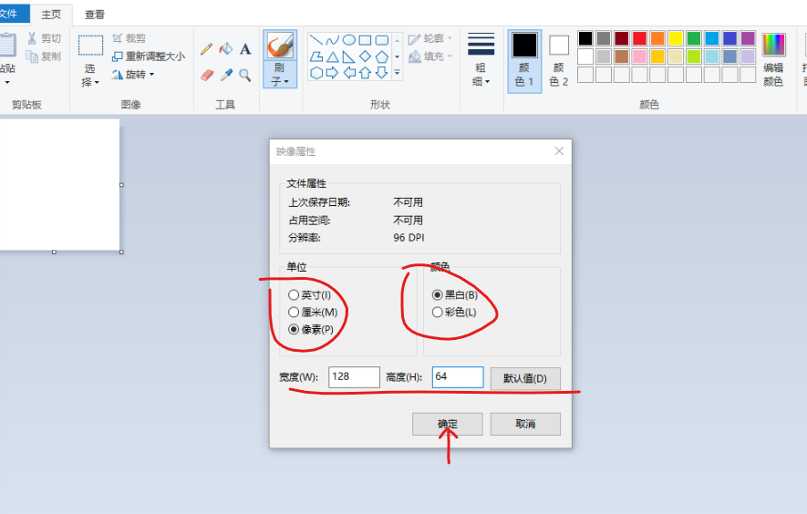
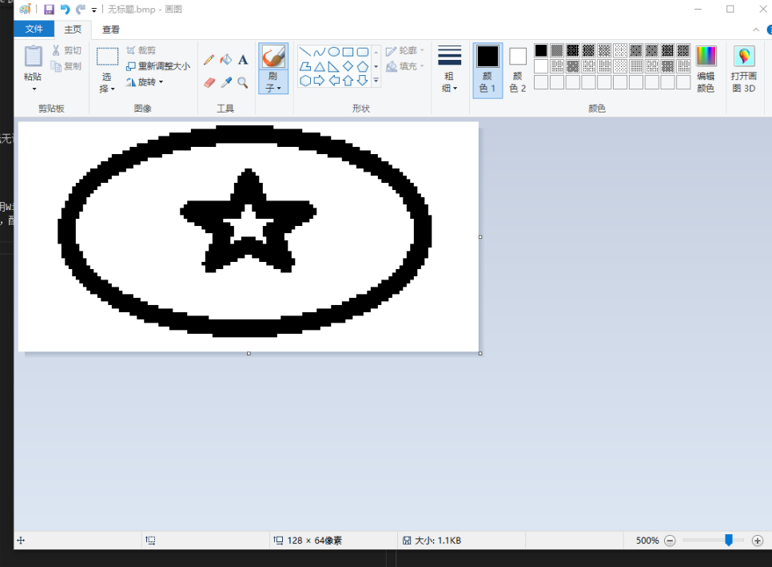

# OLED show_image 说明
oled 自己取模并显示黑白格式图片。
## 图片自定义取模
打开 取模软件/ 目录下的 点阵液晶取模.exe,界面如下

点击新建图像，然后宽度和高度分别选择128、64，点击确定

然后就可以开始涂鸦了（点击像素点颜色反转）

渡鸦完成之后设置取模参数

设置完成之后在取模方式选项里点击c51格式，会看到在下面的点阵生成区出现一堆16进制数，这就是字模数组

将数组里的所有值复制出来，然后在oled.c文件末尾创建一个数组
```c
    const unsigned char my_img1[1024]
     {
            //将复制出来的数组黏贴到这里
     };
```
然后在OLED_font.h文件里声明数组
```c
    extern const unsigned char my_img1[1024];
```
确保程序已经将oled, iic等初始化完成，并且接口连线无误，调用
```c
    oled_show_img((u8*)my_img1);
```
就可以可显示图片了</br>
128*64的点阵用手一个个的取出模型来实在太费劲了，用Windows自带的画图工具可以完美的解决这个问题。</br>
打开画图工具，新建一个图像，再打开 文件/属性 一栏，配置位128*64的像素图格式,点击确定。

然后就可以用里面提供的工具尽情发挥了 = =

最后保存的时候记得保存为.bmp格式的图片。
然后打开刚才的取模软件，在基本操作里选择打开图像图标，选择刚才的.bmp图片进行导入，然后点击c51格式取模...再按照上面一样的方法创建数组，调用就OK.
